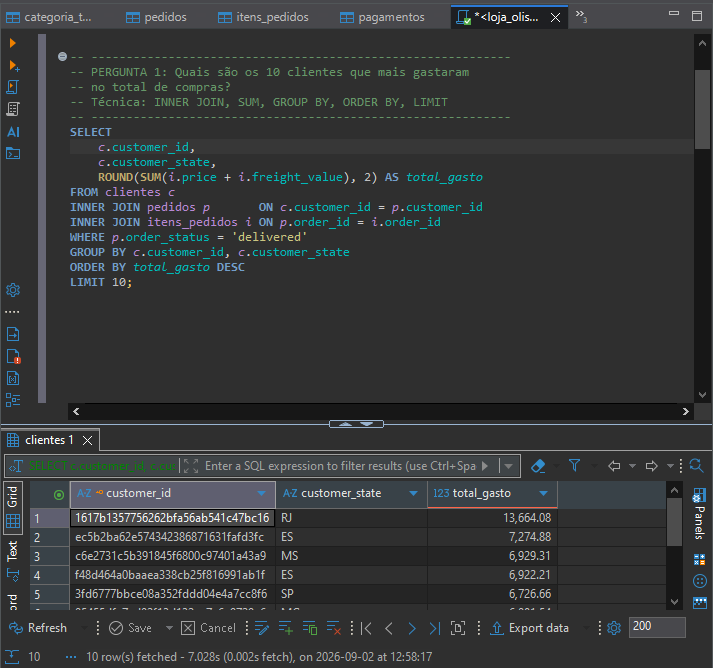
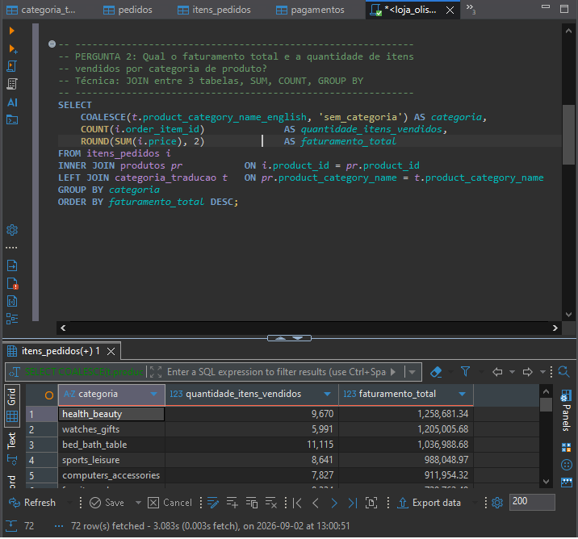
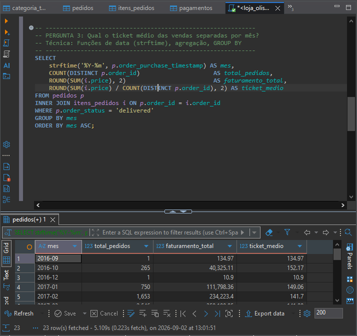
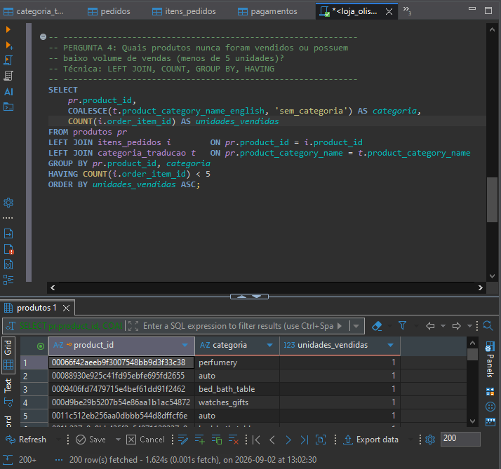
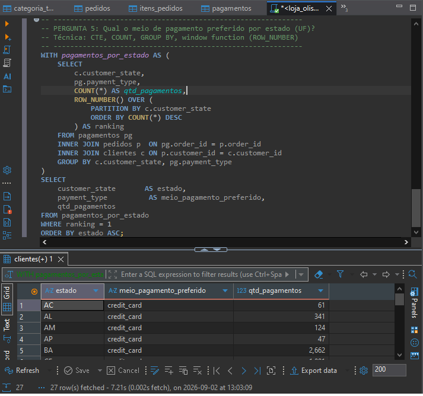

# 📊 Análise Comercial em SQL — Dataset Olist E-Commerce

Projeto de portfólio para consolidar habilidades em **modelagem de banco de dados relacional** e **consultas SQL avançadas** (JOINs, agregações, CTEs e window functions), respondendo a 5 perguntas reais de negócio.

## 🎯 Sobre o projeto

Este projeto simula o dia a dia de um analista de dados: a partir de dados brutos de um e-commerce, foi criado um banco relacional, os dados foram carregados e analisados via SQL puro para responder perguntas estratégicas de negócio.

- **Dataset:** [Brazilian E-Commerce Public Dataset by Olist](https://www.kaggle.com/datasets/olistbr/brazilian-ecommerce) (Kaggle) — mais de 99 mil pedidos entre 2016 e 2018
- **Banco de dados:** SQLite
- **Ferramenta:** DBeaver Community
- **Técnicas aplicadas:** DDL, INNER/LEFT JOIN, GROUP BY, HAVING, funções de data, CTE (Common Table Expression), window function (`ROW_NUMBER`)

## 🗂️ Modelo de dados

O banco foi estruturado em 6 tabelas relacionadas entre si:

| Tabela | Descrição |
|---|---|
| `clientes` | Dados dos clientes (id, cidade, estado) |
| `produtos` | Dados dos produtos (id, categoria, dimensões) |
| `categoria_traducao` | Tradução das categorias de produto (PT → EN) |
| `pedidos` | Pedidos realizados (status, datas) |
| `itens_pedidos` | Itens de cada pedido (produto, preço, frete) |
| `pagamentos` | Forma de pagamento de cada pedido |

O script completo de criação está em [`schema.sql`](./schema.sql).

## ❓ As 5 perguntas de negócio

### 1. Quais são os 10 clientes que mais gastaram no total de compras?

```sql
SELECT
    c.customer_id,
    c.customer_state,
    ROUND(SUM(i.price + i.freight_value), 2) AS total_gasto
FROM clientes c
INNER JOIN pedidos p       ON c.customer_id = p.customer_id
INNER JOIN itens_pedidos i ON p.order_id = i.order_id
WHERE p.order_status = 'delivered'
GROUP BY c.customer_id, c.customer_state
ORDER BY total_gasto DESC
LIMIT 10;
```

| # | Estado | Total gasto (R$) |
|---|---|---|
| 1 | RJ | 13.664,08 |
| 2 | ES | 7.274,88 |
| 3 | MS | 6.929,31 |
| 4 | ES | 6.922,21 |
| 5 | SP | 6.726,66 |
| 6 | MG | 6.081,54 |
| 7 | RJ | 4.950,34 |
| 8 | SP | 4.764,34 |

*(tabela completa com os 10 clientes e IDs em [`prints/pergunta1.png`](./prints/pergunta1.png))*

📷 

---

### 2. Qual o faturamento total e a quantidade de itens vendidos por categoria de produto?

```sql
SELECT
    COALESCE(t.product_category_name_english, 'sem_categoria') AS categoria,
    COUNT(i.order_item_id)              AS quantidade_itens_vendidos,
    ROUND(SUM(i.price), 2)              AS faturamento_total
FROM itens_pedidos i
INNER JOIN produtos pr           ON i.product_id = pr.product_id
LEFT JOIN categoria_traducao t   ON pr.product_category_name = t.product_category_name
GROUP BY categoria
ORDER BY faturamento_total DESC;
```

| Categoria | Itens vendidos | Faturamento (R$) |
|---|---|---|
| health_beauty | 9.670 | 1.258.681,34 |
| watches_gifts | 5.991 | 1.205.005,68 |
| bed_bath_table | 11.115 | 1.036.988,68 |
| sports_leisure | 8.641 | 988.048,97 |
| computers_accessories | 7.827 | 911.954,32 |

*(72 categorias no total — resultado completo em [`prints/pergunta2.png`](./prints/pergunta2.png))*

📷 

---

### 3. Qual o ticket médio das vendas separadas por mês?

```sql
SELECT
    strftime('%Y-%m', p.order_purchase_timestamp) AS mes,
    COUNT(DISTINCT p.order_id)                     AS total_pedidos,
    ROUND(SUM(i.price), 2)                         AS faturamento_total,
    ROUND(SUM(i.price) / COUNT(DISTINCT p.order_id), 2) AS ticket_medio
FROM pedidos p
INNER JOIN itens_pedidos i ON p.order_id = i.order_id
WHERE p.order_status = 'delivered'
GROUP BY mes
ORDER BY mes ASC;
```

| Mês | Pedidos | Faturamento (R$) | Ticket médio (R$) |
|---|---|---|---|
| 2016-09 | 1 | 134,97 | 134,97 |
| 2016-10 | 265 | 40.325,11 | 152,17 |
| 2016-12 | 1 | 10,90 | 10,90 |
| 2017-01 | 750 | 111.798,36 | 149,06 |
| 2017-02 | 1.653 | 234.223,40 | 141,70 |

*(23 meses no total, de set/2016 a ago/2018 — resultado completo em [`prints/pergunta3.png`](./prints/pergunta3.png))*

📷 

---

### 4. Quais produtos nunca foram vendidos ou possuem baixo volume de vendas (menos de 5 unidades)?

```sql
SELECT
    pr.product_id,
    COALESCE(t.product_category_name_english, 'sem_categoria') AS categoria,
    COUNT(i.order_item_id) AS unidades_vendidas
FROM produtos pr
LEFT JOIN itens_pedidos i        ON pr.product_id = i.product_id
LEFT JOIN categoria_traducao t   ON pr.product_category_name = t.product_category_name
GROUP BY pr.product_id, categoria
HAVING COUNT(i.order_item_id) < 5
ORDER BY unidades_vendidas ASC;
```

**Resultado:** mais de 200 produtos identificados com baixo volume de vendas (menos de 5 unidades), em categorias como *perfumery*, *auto*, *bed_bath_table* e *watches_gifts* — indicando produtos parados em estoque ou pouco competitivos, candidatos a revisão de preço ou descontinuação.

*(resultado completo em [`prints/pergunta4.png`](./prints/pergunta4.png))*

📷 

---

### 5. Qual o meio de pagamento preferido por estado (UF)?

```sql
WITH pagamentos_por_estado AS (
    SELECT
        c.customer_state,
        pg.payment_type,
        COUNT(*) AS qtd_pagamentos,
        ROW_NUMBER() OVER (
            PARTITION BY c.customer_state
            ORDER BY COUNT(*) DESC
        ) AS ranking
    FROM pagamentos pg
    INNER JOIN pedidos p  ON pg.order_id = p.order_id
    INNER JOIN clientes c ON p.customer_id = c.customer_id
    GROUP BY c.customer_state, pg.payment_type
)
SELECT
    customer_state       AS estado,
    payment_type          AS meio_pagamento_preferido,
    qtd_pagamentos
FROM pagamentos_por_estado
WHERE ranking = 1
ORDER BY estado ASC;
```

| Estado | Meio de pagamento preferido | Qtd. pagamentos |
|---|---|---|
| AC | credit_card | 61 |
| AL | credit_card | 341 |
| AM | credit_card | 124 |
| AP | credit_card | 47 |
| BA | credit_card | 2.662 |

**Insight:** o cartão de crédito (`credit_card`) é o meio de pagamento preferido em praticamente todos os 27 estados brasileiros, confirmando o comportamento já conhecido do e-commerce nacional.

*(as 27 UFs em [`prints/pergunta5.png`](./prints/pergunta5.png))*

📷 

## 📁 Estrutura do repositório

```
projeto-sql-vendas-olist/
│
├── README.md
├── schema.sql
├── queries_analise.sql
│
└── prints/
    ├── pergunta1.png
    ├── pergunta2.png
    ├── pergunta3.png
    ├── pergunta4.png
    └── pergunta5.png
```

## 🔧 Como reproduzir

1. Baixe o [dataset Olist](https://www.kaggle.com/datasets/olistbr/brazilian-ecommerce) no Kaggle
2. Crie um banco SQLite (ex: no DBeaver)
3. Rode o [`schema.sql`](./schema.sql) para criar as tabelas
4. Importe os arquivos CSV correspondentes em cada tabela
5. Rode as queries em [`queries_analise.sql`](./queries_analise.sql)

---

*Projeto desenvolvido como parte de um portfólio de dados para vagas de estágio/júnior.*
